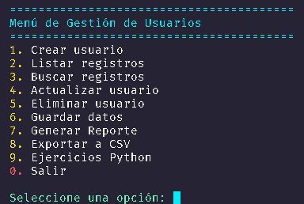
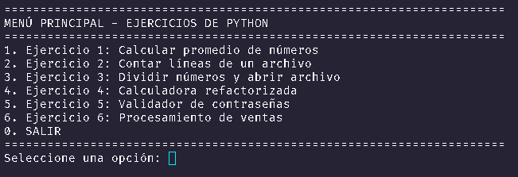
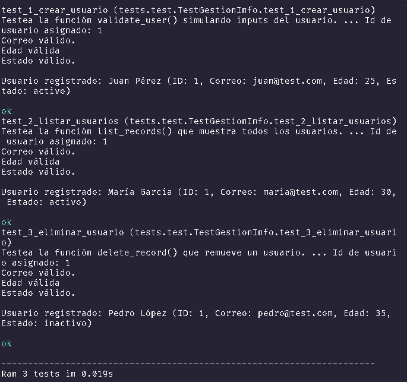

# 📋 Gestion-Info

Un sistema de gestión de usuarios basado en consola que demuestra **operaciones CRUD**, **arquitectura limpia** y **persistencia en JSON** con Python. Perfecto para aprender buenas prácticas en gestión de datos y patrones de diseño de software.

---

## 🎯 Características

- ✅ **Crear Usuarios** — Registrar nuevos usuarios con IDs auto-incrementados y validación
- 📖 **Listar Registros** — Ver todos los usuarios ordenados alfabéticamente por nombre
- 🔍 **Buscar Usuario** — Encontrar usuarios por nombre (búsqueda sin distinción de mayúsculas)
- ✏️ **Actualizar Usuarios** — Modificar detalles del usuario (nombre, email, edad, estado)
- 🗑️ **Eliminar Usuarios** — Eliminar usuarios del sistema
- 💾 **Persistencia de Datos** — Guardar y cargar datos de usuarios desde JSON con manejo de errores
- 📊 **Reportes con Pandas** — Generar reportes filtrados y agrupados con análisis de datos
- 📥 **Exportar a CSV** — Exportar registros a archivos CSV con filtrado y ordenamiento avanzado
- 🎓 **Arquitectura Limpia** — Separación de responsabilidades con módulos dedicados para servicio, validación y capas de datos

---

## 📦 Inicio Rápido

### Requisitos Previos
- **Python 3.10** o superior
- **Dependencias externas** listadas en `requirements.txt`

### Instalación

1. **Clonar el repositorio**
```bash
git clone https://github.com/OliverN77/proyecto-transferencia.git
```

2. **Instalar dependencias**
```bash
pip install -r requirements.txt
```

Este comando instalará:
- **pandas** — para análisis de datos y exportación a CSV
- **colorama** — para estilos de color en consola
- **openpyxl** — soporte para reportes en Excel
- **unittest2** - para crear y ejecutar pruebas unitarias automatizadas

3. **Ejecutar la aplicación**
```bash
python src/main.py
```

### Uso Básico

Una vez que se inicializa la aplicación, verás un menú interactivo:

```
========================================
Menú de Gestión de Usuarios
========================================
1. Crear usuario
2. Listar registros
3. Buscar registros
4. Actualizar usuario
5. Eliminar usuario
6. Guardar datos
7. Generar Reporte
8. Exportar a CSV
9. Ejercicios Python
0. Salir

Seleccione una opción: 
```

**Ejemplo de flujo de trabajo:**
1. Selecciona la opción **1** para registrar un nuevo usuario
2. Ingresa nombre, email, edad y estado
3. Ver usuarios con la opción **2**
4. Generar reportes con la opción **7** (con filtros y agrupación disponibles)
5. Exportar datos a CSV con la opción **8** (con opciones de filtrado avanzado)
6. Acceder a la suite de ejercicios Python con la opción **9**
7. Guardar cambios a JSON con la opción **6** antes de salir

---

## 🧪 Pruebas Unitarias

El proyecto incluye una suite completa de pruebas unitarias usando **unittest2 (≥1.1.0)**.

### Ejecutar Todos los Tests
```powershell
python -m unittest tests.test -v
```

### Ejecutar Tests Individuales

**Test 1 - Crear Usuario:**
```powershell
python -m unittest tests.test.TestGestionInfo.test_1_crear_usuario -v
```

**Test 2 - Listar Usuarios:**
```powershell
python -m unittest tests.test.TestGestionInfo.test_2_listar_usuarios -v
```

**Test 3 - Eliminar Usuario:**
```powershell
python -m unittest tests.test.TestGestionInfo.test_3_eliminar_usuario -v
```

### Cobertura de Tests

Los tests cubren el flujo completo:
1. ✅ **test_1_crear_usuario** — Valida creación de usuarios con todos los campos requeridos
2. ✅ **test_2_listar_usuarios** — Verifica que usuarios creados aparecen en listado
3. ✅ **test_3_eliminar_usuario** — Confirma eliminación correcta de registros

**Características de Testing:**
- Uso de `@patch` para mockear inputs del usuario
- `side_effect` para simular entrada secuencial
- `setUp()` para resetear estado entre tests
- `self.assertEqual()` y `self.assertIsNotNone()` para verificaciones robustas
- Sincronización de referencias entre módulos para testing consistente

---

## 🎓 Ejercicios Python

La aplicación incluye una suite de **6 ejercicios prácticos de Python** ubicados en la carpeta `assets/`, accesibles desde la opción **9** del menú principal. Estos ejercicios cubren conceptos fundamentales como manejo de errores, operaciones de archivos, validación de datos y procesamiento de información.

### 📚 Descripción de Ejercicios

#### 1️⃣ Ejercicio 1: Calcular Promedio de Números
**Archivo:** `assets/a1.py`

**Objetivo:** Leer múltiples números separados por comas, calcular su promedio y manejar errores de conversión.

**Conceptos cubiertos:**
- Entrada de datos (`input()`)
- Comprensión de listas (`[int(num.strip()) for num in numeros_str.split(",")]`)
- Operaciones matemáticas (suma, división)
- Manejo de excepciones (`try-except`)

**Ejemplo de uso:**
```
Ingrese números enteros separados por comas: 10, 20, 30, 40
Números ingresados: [10, 20, 30, 40]
Suma: 100
Cantidad: 4
✓ Promedio: 25.00
```

---

#### 2️⃣ Ejercicio 2: Contar Líneas de un Archivo
**Archivo:** `assets/a2.py`

**Objetivo:** Abrir un archivo de texto especificado por el usuario, contar el número de líneas y manejar errores de archivo.

**Conceptos cubiertos:**
- Apertura y lectura de archivos (`open()`, `readlines()`)
- Manejo de excepciones específicas (`FileNotFoundError`)
- Bloque `try-except-else-finally` para gestión robusta de recursos
- Cierre de archivos (`close()`)

**Ejemplo de uso:**
```
Ingrese el nombre del archivo (ej: archivo.txt): datos.txt
✓ El archivo 'datos.txt' tiene 5 línea(s).
Primera línea: Contenido de la primera línea
Archivo cerrado correctamente.
```

---

#### 3️⃣ Ejercicio 3: Dividir Números y Abrir Archivo
**Archivo:** `assets/a3.py`

**Objetivo:** Menú interactivo que permite dividir números o abrir y leer la primera línea de un archivo.

**Conceptos cubiertos:**
- Submenús interactivos (bucles `while`)
- División de números con manejo de `ZeroDivisionError`
- Lectura de archivos con `readline()`
- Validación de entrada del usuario

**Opciones del submenú:**
1. Dividir dos números ingresados
2. Abrir archivo `archivo.txt` y mostrar primera línea
3. Volver al menú principal

---

#### 4️⃣ Ejercicio 4: Calculadora Refactorizada
**Archivo:** `assets/a4.py`

**Objetivo:** Implementar una calculadora con operaciones aritméticas básicas usando funciones lambda y manejo robusto de errores.

**Conceptos cubiertos:**
- Funciones lambda para operaciones (`lambda x, y: x + y`)
- Diccionarios como mapa de funciones
- Type hints (`float`, `->` float`)
- Manejo de `ZeroDivisionError`
- Validación de operaciones

**Operaciones disponibles:**
- Suma, Resta, Multiplicación, División

**Ejemplo de uso:**
```
Ingrese el primer número: 100
Ingrese el segundo número: 50
Ingrese la operación (suma, resta, multiplicacion, division): suma
✓ El resultado de 100.0 suma 50.0 = 150.0
```

---

#### 5️⃣ Ejercicio 5: Validador de Contraseñas
**Archivo:** `assets/a5.py`

**Objetivo:** Validar contraseñas según reglas de seguridad usando validadores modulares.

**Conceptos cubiertos:**
- Funciones lambda modulares para validaciones
- Validación de strings (longitud, caracteres especiales)
- Any/All para verificar condiciones múltiples
- Type hints y documentación de funciones

**Requisitos de seguridad:**
- ✓ Mínimo 8 caracteres
- ✓ Al menos 1 dígito
- ✓ Al menos 1 mayúscula
- ✓ Sin espacios

**Ejemplo de uso:**
```
--- VALIDADOR DE CONTRASEÑAS ---
Requisitos:
  • Mínimo 8 caracteres
  • Al menos 1 dígito
  • Al menos 1 mayúscula
  • Sin espacios

Ingresa una contraseña para validar: MyPassword123
✓ Contraseña válida
```

---

#### 6️⃣ Ejercicio 6: Procesamiento de Ventas con Descuentos
**Archivo:** `assets/a6.py`

**Objetivo:** Procesar datos de ventas, calcular totales con descuentos aplicados y generar reportes de ventas inválidas.

**Conceptos cubiertos:**
- Diccionarios para datos estructurados
- Cálculo de descuentos condicionales (cantidad, tipo de cliente)
- Procesamiento de listas de registros
- Manejo de excepciones en bucles
- Funciones para reportes

**Reglas de descuento:**
- 10% si cantidad ≥ 10 unidades
- +5% extra si cliente es "VIP"

**Ejemplo de datos:**
```python
venta = {
    "status": "ok",
    "price": 100,
    "quantity": 15,
    "customer": "vip"
}
# Total: 100 * 15 * (1 - 0.15) = 1275.00
```

---

### 🚀 Acceso a Ejercicios

Para acceder a los ejercicios:

1. Ejecuta la aplicación principal: `python src/main.py`
2. Selecciona la opción **9** del menú
3. Se abrirá el menú de ejercicios con todas las opciones disponibles
4. Selecciona el ejercicio que deseas ejecutar

---

## 📸 Screenshots

A continuación se muestran capturas de pantalla de la aplicación en funcionamiento:

### Menú Principal

*Menú interactivo de Gestión de Usuarios con todas las opciones disponibles (1-9 y 0 para salir)*

### Menú de Ejercicios Python

*Suite de 6 ejercicios prácticos de Python accesibles desde la opción 9 del menú principal*

### Test con unnitest

*Tests rápido como crear usuarios, listarlos y eliminarlos*

---

## 📊 Funcionalidades Avanzadas

### Reportes (Opción 7)
- **Reporte General** — Visualiza todos los usuarios con estadísticas
- **Agrupado por Estado** — Agrupa usuarios por estado (activo/inactivo)
- **Agrupado por Edad** — Agrupa usuarios por edad
- **Solo Activos** — Filtra y muestra solo usuarios activos

### Exportación a CSV (Opción 8)
- **Exportación Completa** — Exporta todos los registros a `reporte_completo.csv`
- **Usuarios Activos** — Exporta solo activos a `usuarios_activos.csv`
- **Mayores de 18** — Exporta mayores de 18 años a `usuarios_mayores_18.csv`
- **Personalizado** — Elige nombre, filtros, y columna para ordenar

**Los archivos se guardan en la carpeta `data/`**

---

## 🏗️ Arquitectura del Proyecto

### Estructura de Directorios

```
gestion-info/
├─ README.md                    # Este archivo - documentación del proyecto
├─ requirements.txt             # Dependencias del proyecto (pandas, colorama, openpyxl, unittest2)
├─ .gitignore                   # Reglas de ignorar archivos para Git
├─ assets/
│  ├─ a1.py                    # Ejercicio 1: Calcular promedio de números
│  ├─ a2.py                    # Ejercicio 2: Contar líneas de un archivo
│  ├─ a3.py                    # Ejercicio 3: Dividir números y abrir archivo
│  ├─ a4.py                    # Ejercicio 4: Calculadora refactorizada
│  ├─ a5.py                    # Ejercicio 5: Validador de contraseñas
│  ├─ a6.py                    # Ejercicio 6: Procesamiento de ventas
│  └─ menu_ejercicios.py       # Menú integrado de todos los ejercicios
├─ data/
│  └─ registros.json           # Archivo JSON con registros persistentes de usuarios
├─ screenshots/
│  ├─ menu_principal.png       # Captura del menú principal
│  └─ menu_ejercicios.png      # Captura del menú de ejercicios
├─ src/
│  ├─ main.py                  # Punto de entrada - orquesta el bucle del menú
│  ├─ menu.py                  # Interfaz de usuario - lógica del menú en consola
│  ├─ service.py               # Lógica empresarial - implementa operaciones CRUD
│  ├─ file.py                  # Capa de datos - maneja persistencia en JSON
│  ├─ validate.py              # Lógica de validación y funciones auxiliares
│  └─ integration.py            # Análisis de datos - reportes y exportación a CSV con Pandas
└─ tests/
   └─ test.py                  # Suite de tests unitarios (unittest)
```

### Responsabilidades de Módulos

| Módulo | Propósito | Funciones Clave |
|--------|-----------|---|
| **main.py** | Punto de entrada y orquestación del menú | Control del flujo de la aplicación |
| **menu.py** | Interfaz de usuario en consola | Mostrar menús y recopilar entrada del usuario |
| **service.py** | Lógica empresarial CRUD | `registrar_usuario()`, `listar_usuarios()`, `buscar_usuario()`, `actualizar_usuario()`, `eliminar_usuario()` |
| **file.py** | Capa de persistencia de datos | Operaciones de lectura/escritura en JSON con manejo de errores |
| **validate.py** | Validación de entrada y auxiliares | Validación de email, rangos de edad, validación de estado |
| **integration.py** | Análisis y exportación de datos | `generate_report()`, `export_to_csv()` |
| **assets/a1.py** | Ejercicio 1: Promedio | Cálculo de promedios con manejo de errores |
| **assets/a2.py** | Ejercicio 2: Archivos | Lectura de archivos y conteo de líneas |
| **assets/a3.py** | Ejercicio 3: División | Submenú con operaciones y lectura de archivos |
| **assets/a4.py** | Ejercicio 4: Calculadora | Operaciones aritméticas con lambdas |
| **assets/a5.py** | Ejercicio 5: Validador | Validación de contraseñas con reglas de seguridad |
| **assets/a6.py** | Ejercicio 6: Ventas | Procesamiento de ventas con descuentos |
| **assets/menu_ejercicios.py** | Menú integrado de ejercicios | Orquestación de todos los ejercicios |
| **tests/test.py** | Suite de pruebas unitarias | `test_1_crear_usuario()`, `test_2_listar_usuarios()`, `test_3_eliminar_usuario()` |

---

## 📝 Estilo de Código y Convenciones

Este proyecto sigue **PEP 8** con énfasis en **nomenclatura snake_case**:

### Convenciones de Nombres

```python
# ✅ Variables y funciones: snake_case
nombre_usuario = "Oliver Nieto"
def registrar_usuario(nombre, email, edad, estado):
    pass

# ✅ Constantes: UPPER_SNAKE_CASE
EDAD_MAXIMA = 99
EDAD_MINIMA = 1
RUTA_ARCHIVO_JSON = "data/registros.json"

# ✅ Clases: PascalCase
class ServicioUsuario:
    pass

# ❌ Evitar camelCase
nombreUsuario = "Oliver"  # NO nombreUsuario
```

### Nomenclatura de Archivos

- Todos los archivos Python usan **snake_case**: `main.py`, `service.py`, `file.py` (NO Main.py o ServiceFile.py)
- Los archivos de datos siguen la convención: `registros.json`

---

## 📊 Modelo de Datos

### Estructura de Registros de Usuario (Dinámica)

Los usuarios se almacenan en `data/registros.json` en un formato JSON flexible y escalable. El archivo crece dinámicamente a medida que se registran nuevos usuarios, con IDs auto-incrementados:

```json
{
  "usuarios": [
    {
      "id": 1,
      "nombre": "Juan Pérez",
      "email": "juan@example.com",
      "edad": 28,
      "estado": "activo"
    },
    {
      "id": 2,
      "nombre": "María García",
      "email": "maria@example.com",
      "edad": 35,
      "estado": "inactivo"
    },
    {
      "id": 3,
      "nombre": "Carlos López",
      "email": "carlos@example.com",
      "edad": 42,
      "estado": "activo"
    }
  ]
}
```

**Características dinámicas:**
- ✨ Los IDs se generan automáticamente (1, 2, 3, ...)
- ✨ El archivo JSON crece con cada nuevo usuario registrado
- ✨ Los cambios se guardan solo al usar la opción "Guardar cambios"
- ✨ Soporta caracteres internacionales (UTF-8)

### Reglas de Validación de Campos

| Campo | Tipo | Validación | Ejemplo |
|-------|------|-----------|---------|
| **id** | Entero | Auto-incrementado, único | `1`, `2`, `3` |
| **nombre** | Cadena | Requerido | `"Oliver Nieto"` |
| **email** | Cadena | Debe contener `@` y `.` | `"oliver@example.com"` |
| **edad** | Entero | Rango: 1-99 | `25` |
| **estado** | Cadena | `"activo"` o `"inactivo"` | `"activo"` |

---

## 💻 Detalles Técnicos

### Persistencia de Datos
- **Formato**: JSON (legible por humanos, fácil de inspeccionar y depurar)
- **Ubicación**: `data/registros.json`
- **Codificación**: UTF-8 para soporte de caracteres internacionales
- **Manejo de Errores**: Recuperación elegante si el archivo está corrupto o falta

### Gestión de Memoria
1. La aplicación carga todos los usuarios desde JSON en memoria al inicio
2. Todas las operaciones CRUD trabajan con datos en memoria (operaciones rápidas)
3. Opción explícita de "Guardar cambios" persiste datos a archivo JSON
4. Previene pérdida accidental de datos mediante paso de guardado intencional

---

## 🚀 Módulo de Integración (integration.py)

El módulo `src/integration.py` implementa funcionalidades avanzadas de **análisis de datos y exportación** usando la librería **Pandas**:

### 📊 Funciones Implementadas

#### 1. `generate_report(users_data, **kwargs)`
**Propósito:** Genera reportes detallados de usuarios desde `data/registros.json` convertidos a DataFrames de Pandas.

**Características:**
- ✅ Convierte lista de usuarios a DataFrame (estructura tabular)
- ✅ Agrupación por campos: estado (activo/inactivo), edad
- ✅ Estadísticas automáticas: cantidad total, edad promedio, edad máxima/mínima
- ✅ Conteo de usuarios por estado
- ✅ Formato colorizado en consola con timestamps
- ✅ Manejo robusto de errores

**Parámetros:**
```python
generate_report(
    users_data,           # Lista de usuarios (diccionarios)
    group_by='status',    # Campo opcional para agrupar ('status' o 'age')
    show_stats=True       # Mostrar estadísticas (default: True)
)
```

**Ejemplo de salida:**
```
============================================================
Reporte de Usuarios - 10/04/2026 14:30:45
============================================================

Total de registros: 5
[DataFrame con todos los usuarios]

============================================================
Estadísticas
============================================================
Total de usuarios: 5
Edad promedio: 28.4 años
Edad máxima: 42 años
Edad mínima: 18 años

Estado de usuarios:
  Activo: 4
  Inactivo: 1
```

---

#### 2. `export_to_csv(users_data=None, **kwargs)`
**Propósito:** Exporta registros desde `data/registros.json` a archivos CSV usando Pandas con opciones de filtrado y ordenamiento.

**Características:**
- ✅ Convierte usuarios a DataFrame y luego a CSV
- ✅ Carga automática de `data/registros.json` si no se proporcionan datos
- ✅ Filtrado por estado (activo/inactivo)
- ✅ Filtrado por rango de edad (edad mínima)
- ✅ Ordenamiento personalizado por cualquier columna
- ✅ Nombres de archivo personalizables
- ✅ Codificación UTF-8 para caracteres internacionales
- ✅ Guardado automático en carpeta `data/`

**Parámetros:**
```python
export_to_csv(
    users_data=None,           # Lista de usuarios (carga de JSON si es None)
    filename='reporte.csv',    # Nombre del archivo de salida
    filter_status='activo',    # Filtrar por estado ('activo', 'inactivo')
    sort_by='id',              # Columna para ordenar
    min_age=None               # Edad mínima para filtrar
)
```

**Ejemplos de uso:**

```python
# Exportar todos (carga de registros.json automáticamente)
export_to_csv(filename='usuarios_completo.csv')

# Exportar solo activos, ordenado por nombre
export_to_csv(
    filename='usuarios_activos.csv',
    filter_status='activo',
    sort_by='name'
)

# Exportar mayores de 18 años
export_to_csv(
    filename='usuarios_18plus.csv',
    min_age=18
)

# Filtro combinado: activos y mayores de 25
export_to_csv(
    filename='activos_25plus.csv',
    filter_status='activo',
    min_age=25,
    sort_by='age'
)
```

**Archivos generados** (guardados en `data/`)
- `usuarios_completo.csv` — Todos los registros
- `usuarios_activos.csv` — Solo usuarios activos
- `usuarios_18plus.csv` — Mayores de 18 años
- Y cualquier archivo personalizado

---

### 💡 Tecnologías Utilizadas

- **Pandas** — Manipulación y análisis de datos tabular
- **DataFrame** — Estructura tabular para procesamiento eficiente
- **Pathlib** — Manejo de rutas independiente del SO
- **Colorama** — Formateo colorizado en consola
- **UTF-8** — Soporte de caracteres internacionales

---

### 🔮 Mejoras Futuras Planeadas

El módulo puede extenderse con:
- **Generación de reportes Excel** — Exportar a `.xlsx` con estilos
- **Integración Faker** — Generar datos de prueba realistas automáticamente
- **Gráficos Matplotlib** — Visualizaciones de distribuciones
- **API REST** — Exponer reportes vía Flask/FastAPI
- **Base de Datos** — Migrar de JSON a SQLite/PostgreSQL para escalabilidad
- **Autenticación** — Control de acceso basado en permisos

---

## 📚 Resultados de Aprendizaje

Este proyecto demuestra:

- ✓ **Operaciones CRUD** — Flujo completo de gestión de datos
- ✓ **Arquitectura Limpia** — Separación de preocupaciones (UI, lógica empresarial, persistencia)
- ✓ **Persistencia JSON** — Trabajo con datos estructurados y E/S de archivos
- ✓ **Validación de Entrada** — Aseguramiento de integridad de datos
- ✓ **Convención Snake_case** — Estándares profesionales de nomenclatura en Python
- ✓ **Programación Funcional** — Uso de `lambda`, `filter()` y comprensiones de listas
- ✓ **Manejo de Errores** — Recuperación elegante de entrada inválida y errores de archivos

---

## 📄 Licencia

Licencia MIT — Siéntete libre de usar este proyecto con fines de aprendizaje y personales.

---

## 👤 Créditos

**Estudiante:** Oliver Nieto  
**Ficha:** 3406211  
**Tipo de Proyecto:** Proyecto de transferencia
**Creado:** 2026

---

## ❓ Preguntas Frecuentes

**P: ¿Puedo agregar más campos a los registros de usuario?**  
R: ¡Sí! Actualiza las reglas de validación en `src/validate.py` y modifica las indicaciones del menú en `src/menu.py`.

**P: ¿Qué pasa si el archivo JSON se corrompe?**  
R: El módulo `src/file.py` incluye manejo de errores. Te alertará y creará una copia de seguridad.

**P: ¿Cómo reinicio todos los datos?**  
R: Elimina `data/registros.json` y reinicia la aplicación—creará un archivo nuevo.

**P: ¿Puedo ejecutar esto en Windows/Mac/Linux?**  
R: ¡Sí! Python y JSON son multiplataforma. Funciona en todos los sistemas operativos.